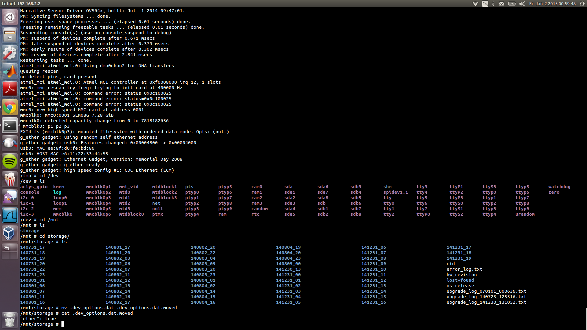

# Memoto / Narrative Clip

More about this lifelong logging camera can be read on <http://getnarrative.com/> and <https://www.kickstarter.com/projects/martinkallstrom/memoto-lifelogging-camera>. 

Of course I got this one from Kickstarter and I quickly figured out that I needed Windows or MacOS to be able to use it.
Windows isn't good for my heart, and MacOS isn't good for my wallet. Hence, I led one of my interns use it for a while
to check if she could get some useful data with respect to logging eating and drinking habits. She is an industrial
design student with the assignment to break such habits with the invention of a smartphone addon. Remarkable by the way
that there are so many wristbands and smartwatches to measure activity, but so few devices that look at intake - or later
in the digestive process :) - or habit breaking c.q. establishing technological aids.

Anyway, finally I found some time to start hacking the Memoto. Note, this hack only is about reading from the device
using the custom firmware on it. This is not reading out that firmware, or reverse engineering the firmware on the 
device itself.

## What is this?

The following will be some description of the hack, but you can also just clone this repository and start using it. 
What you will be able to do:

* download files from the Memoto using the python script `memoto.py` using a Linux operating system (might be working
on other platforms as well, just try it out and report back)
* upload files to the Memoto using the same script `memoto.py` using a Linux operating system
* enable a `developmental` option on the Memoto
* subsequently the Memoto becomes available in a normal fashion to almost all modern operating systems 
* change the frequency with which you snap pictures
* use the Memoto as a fancy USB drive which also happens to take pictures

## Screenshot

So, you know it was a success before you've to read this long story. :-) 

## Setup

The setup is easy to imagine. We have to run a VirtualBox with Windows 7. First hurdle needs to be taken. By default
VirtualBox does **not** support USB 2. You will need an extension pack.

    $> VBoxManage list extpacks
    Extension Packs: 1
    Pack no. 0:   Oracle VM VirtualBox Extension Pack
    Version:      4.3.20
    Revision:     96996
    Edition:      
    Description:  USB 2.0 Host Controller, Host Webcam, VirtualBox RDP, PXE ROM with E1000 support.
    VRDE Module:  VBoxVRDP
    Usable:       true 

I installed this extension pack, but apparently my newest OS updated VirtualBox, but not the extension pack, so make
sure you use `VBoxManage list extpacks` to check if it states `Usable: true`. Next in the VirtualBox, you will have to
check `Enable USB 2.0 (EHCI) Controller`. It might be useful to add the memoto to the `USB Device Filters`. You will
see it show up as `Narrative Clip [0108]`. This makes it automatically connect to the Windows 7 instance, really neat!
When debugging though, you might want to turn it off, because after every unfortunate accident, the port or the device
resets itself, which makes Windows 7 grab it. And you'll have to unmount every time you want to read or write from it
from your host.

On the host set up wireshark. On a fairly recent kernel this is super simple and you can skip almost everything on
their [wiki](http://wiki.wireshark.org/CaptureSetup/USB):

    sudo modprobe usbmon
    # the following is your usbmonX number to use in wireshark
    lsusb -d f0f0:1337 | cut -f2 -d' '

In my case it connects to `Bus 3`, so let's start capturing in wireshark on /dev/usbmon3.

Now, it is time to install everything from Memoto / Narrative in the Windows 7 instance. Connect your device and look
at all the USB traffic and get yourself a nice cup of coffee. I recommend [Moyee Coffee](http://www.moyeecoffee.com/), 
the first fair-chain rather than just fair-trade coffee available. 

## Interlude

Just got this Missile Launcher for christmas. I've to use it from Linux as well of course. Searching online quickly
brings up [ml-driver](https://github.com/mavam/ml-driver). It happens to be that Matthias Vallentin not only had the
same problem, but also thought, what the heck, let I learn something from it, and write a kernel driver for fun. After
a few small adaptations this worked like a blast.

Of course nowadays you actually don't need to write a kernel driver, with libusb you're pretty much set. I found this
python script [retaliation](https://github.com/codedance/Retaliation) which allows you to set up it such that commands
can be send over UDP, neat. Python I normally never use, but for scripting I like it quite a lot. So, I start with the
code from Retaliation although you might find nothing anymore from the original code. If you're a Python afficionado
I probably will accept any pull request. :-)

## Start

First, probe the thing a bit more. 

	$> lsusb -vvv -d f0f0:1337                                    

	Bus 003 Device 045: ID f0f0:1337  
	Device Descriptor:
	  bLength                18
	  bDescriptorType         1
	  bcdUSB               2.00
	  bDeviceClass          255 Vendor Specific Class
	  bDeviceSubClass         0 
	  bDeviceProtocol         0 
	  bMaxPacketSize0        64
	  idVendor           0xf0f0 
	  idProduct          0x1337 
	  bcdDevice            1.08
	  iManufacturer           1 Narrative
	  iProduct                2 Narrative Clip
	  iSerial                 3 82394893248932943093934204a48b99
	  bNumConfigurations      1
	  Configuration Descriptor:
	    bLength                 9
	    bDescriptorType         2
	    wTotalLength           32
	    bNumInterfaces          1
	    bConfigurationValue     1
	    iConfiguration          4 Narrative USB #1
	    bmAttributes         0xc0
	      Self Powered
	    MaxPower              450mA
	    Interface Descriptor:
	      bLength                 9
	      bDescriptorType         4
	      bInterfaceNumber        0
	      bAlternateSetting       0
	      bNumEndpoints           2
	      bInterfaceClass       255 Vendor Specific Class
	      bInterfaceSubClass      0 
	      bInterfaceProtocol      0 
	      iInterface              5 Narrative Clip
	      Endpoint Descriptor:
		bLength                 7
		bDescriptorType         5
		bEndpointAddress     0x81  EP 1 IN
		bmAttributes            2
		  Transfer Type            Bulk
		  Synch Type               None
		  Usage Type               Data
		wMaxPacketSize     0x0200  1x 512 bytes
		bInterval               0
	      Endpoint Descriptor:
		bLength                 7
		bDescriptorType         5
		bEndpointAddress     0x02  EP 2 OUT
		bmAttributes            2
		  Transfer Type            Bulk
		  Synch Type               None
		  Usage Type               Data
		wMaxPacketSize     0x0200  1x 512 bytes
		bInterval               1
	Device Qualifier (for other device speed):
	  bLength                10
	  bDescriptorType         6
	  bcdUSB               2.00
	  bDeviceClass          255 Vendor Specific Class
	  bDeviceSubClass         0 
	  bDeviceProtocol         0 
	  bMaxPacketSize0        64
	  bNumConfigurations      1
	Device Status:     0x0001
	  Self Powered

Here you see that there are two endpoints. Both are of the `bulk` type. The end point that is used to obtain the
files from the device are obtained from endpoint `0x81`. 

The files are stored in the folder `/mnt/storage`. There will be `.jpg` files in there as well as `.meta.json` files.
This folder has subfolders such as `140804_02`, and the files have `iSerial` as part of their filename. 

## Usage

You can use the script `memoto.py` to get a listing of files on the device. Not all directories are accessible though.
To list the files in the storage directory:

	python memoto.py list /mnt/storage

This will give you a list like the following

	140802_13
	141231_07
	140731_17
	.gfs_options.dat
	upgrade_log_140723_125516.txt
	lost+found
	hw_revision
	upgrade_log_070101_000636.txt
	.timestamp
	os-release
	error_log.txt
	upgrade_log_141230_131052.txt

Subsequently, you can take a look in the directories:

	python memoto.py list /mnt/storage/140802_13

To actually obtain a file:

	python memoto.py file /mnt/storage/ upgrade_log_140723_125516.txt

Note that here there is a space between the path and the file. Also note that there is a trailing '/'. I've to make all
these things idiot proof later.

To obtain all files in a certain directory, run:
	
	python memoto.py files /mnt/storage/140802_13

However, this is a difficult one. That I couldn't script properly in a few hours without loosing some BULK request/
response messages. So, don't be surprised if there are .jpg files in the .meta.json files, etc.

## Establishing an ethernet connection

What we need to do now is to upload a file. We are gonna upload a file using `0x10` instead of `0x09` (see code in 
python script). Specifically, we are gonna upload the file `/mnt/storage/.dev_options.dat`. Its content is simply:

	"ether": true

Upload it through;

	python memoto.py upload /mnt/storage .dev_options.dat

Reconnect your device and suddenly you will see another interface appearing if your kernel supports `usbnet`. This will all be automatically triggered, pretty neat from the kernel guys!

The device is at `192.168.2.2`. A port scan reveals:

	PORT   STATE SERVICE VERSION
	21/tcp open  ftp     BusyBox ftpd (D-Link DCS-932L IP-Cam camera)
	23/tcp open  telnet

And sure `ftp 192.168.2.2` and `telnet 192.168.2.2` works just fine.

A directory list can be found in [this file](memoto/blob/master/dump/files). Sorry, the command `tree` wasn't in their busybox installation, so it doesn't look so nice. :-)

## GPS

I understand that some people are really anxious in getting the GPS working properly. There is a file `/etc/init.d/S56aclys` which inserts the kernel module `/lib/modules/2.6.39+/extra/aclys_gpio.ko`. The `aclys_snap` file in `/bin` is quite small, just 15kB. So, there is no encryption done or things like that. Those snap files you can retrieve from the device is probably just raw data from the sensor.

## Memoto daemon

There is a `memotod` binary in `/bin`. This is only 62kB and seems to contain also very little. Most of the code is dedicated to reading the sensors and pushing it to the host device using Linux-USB Gadget framework or `gadgetfs`. This is a pretty neat piece of code that allows you to communicate through just reading and writing to `/dev/gadget`.

## Future proof

To make sure that there is no new firmware uploaded that would make the above impossible, I would recommend to either
deinstall the Memoto software or change one of the scripts on the memoto that is responsible for installing new 
firmware. New firmware comes in a tar ball `update.tar` which unpacks to `update/update.sh`.  Just remove those lines
in the script. This has a nice side-effect that if new firmware is send over by Memoto that it will be available at
your service, without it getting installed. You can casually inspect what great updates are in there before you start
using it. :-)

## Protocol

To be done. Read the python script for now

## Copyrights

Note that this is done independently by some random developer not associated with Memoto / Narrative. I have refrained
from publishing their .lua and .sh scripts here, you can get them yourself if you want to. Their names are their 
respective trademarks, etc. etc. I think the Narrative Clip is a neat piece of hardware and I'm grateful for them to
have developed such a tiny camera package. I hope you guys will come up with nice new ways to use the Memoto just
as with the Kinect, in ways not anticipated before. Note also that there have not been serious encryption measures put
in place. Hence, it is likely that something similar to the Kinect has been the underlying line of thought. The Kinect
was easy to `hack` on purpose (see articles from the original designer) and this indeed opened up a flurry of very
interesting third-party applications. I sincerely hope that this might as well initiate a much large set of 
applications than currently available from which the Narrative people benefit as well. Start coding!

* Author: Anne van Rossum
* License: LGPLv3, BSD, Apache, MIT, your choice
* Date: 31st of December, 2014, 22:56 - I'm now gonna celebrate :-)

