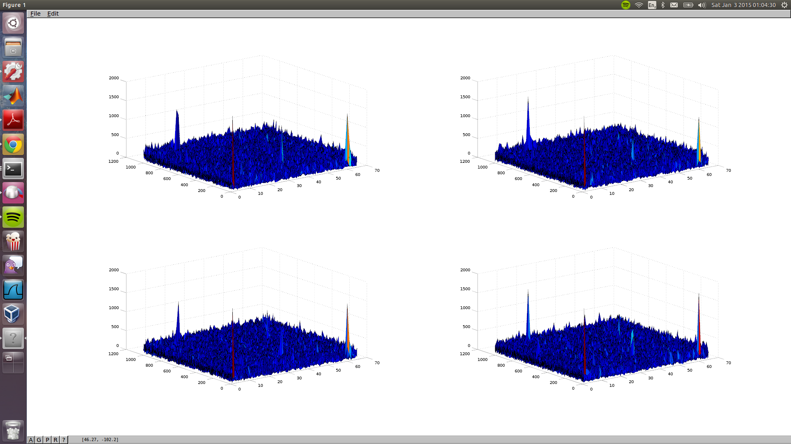

# Some preliminary exercises

I find it hard to get something useful out of the GPS data. 

* https://github.com/ruins/offline-narrative
* https://github.com/ruins/offline-narrative/blob/master/references/SNAP_processing_paper_2010.pdf

Started a bit with fiddling around. From the matlab script you see that there are several distinct peaks. The one at zero is probably some kind of artifact, but there is something interesting there.

If someone can assist with this, that would be great!
